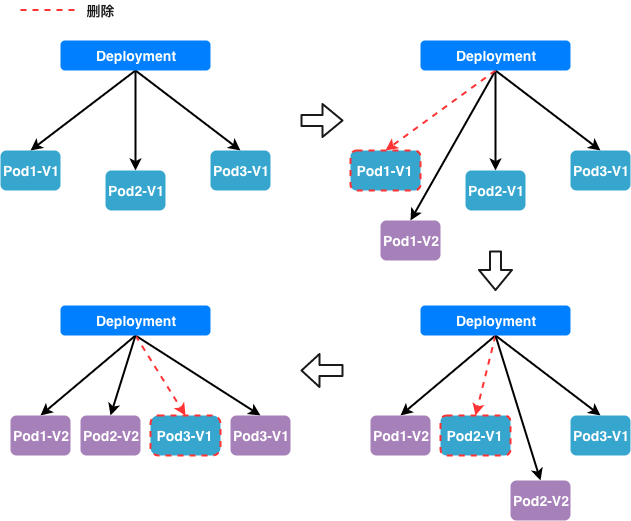

# 如何通过BCS完成滚动升级

## 背景

用户总是希望不管在什么时候都能正常访问应用，当然也包括在应用的升级过程中。当前微服务架构的设计提供了应用升级过程对用户“零感知”的可行性。在微服务架构中，一个服务通常具有多个实例，运维人员可以将一个服务的升级过程按实例拆分为多步进行，保证在应用升级过程中，都有一定数量的可用实例对外提供服务。  

在BCS中，运维人员可以通过**滚动升级**功能来实现应用的逐步升级。运维人员可以通过配置设定滚动更新过程中最大不可用数量、更新时间间隔、最大更新数量等参数，通过可以对滚动更新过程进行人工干预，做到及时暂停或者回滚改次更新操作。

本文通过简单的例子来说明如何通过BCS完成应用的滚动升级过程，保证升级过程服务的可用性。

## 滚动升级过程示意图

滚动升级过程示意图如下，图中Pod与mesos方案中的taskgroup为等价概念



## Mesos方案

在Mesos方案中，可以通过定义deployment对象进行滚动升级操作。  
bcs-deployment是基于bcs-application抽象出的顶层概念、主要满足应用的滚动升级，回滚，暂停，扩、缩容等需求。

### 配置文件说明

在Mesos方案中，deployment拥有多个参数来控制整个滚动升级的行为，同时可以配置相关健康检查参数，详细说明请参考下面链接。

[deployment相关参数说明](../../templates/mesos-artifact/deployment.md)

### 操作说明

* 创建deployment
首先我们创建一个deployment用于演示，该配置文件同时也会创建对应的application。

```bash
bcs-client create -t deployment -f test1-1-0.json
```

当然我们也可以首先创建一个application，然后通过deployment的spec.selector字段与application进行关联。

* 该deployment的滚动更新策略设置为
  * **"maxUnavailable": 1** 每个更新周期最多删除1个taskgroup
  * **"maxSurge": 1** 每个更新周期最多创建1个taskgroup
  * **"upgradeDuration": 60** 每个更新周期为60秒
  * **"rollingOrder": "CreateFirst"** 在新建taskgroup的时候，会先将老版本的taskgroup删除掉
  * **"rollingManually": false** 在一次滚动升级之后，每过一个周期会自动开始另一次滚动升级

test1-1-0.json
```json
{
    "apiVersion": "v4",
    "kind": "deployment",
    "metadata": {
        "labels": {
            "appname": "test"
        },
        "name": "test",
        "namespace": "defaultGroup"
    },
    "constraint": {
        "IntersectionItem": [
            {
                "unionData": [
                    {
                        "name": "InnerIP",
                        "operate": "UNIQUE"
                    }
                ]
            }
        ]
    },
    "spec": {
        "instance": 2,
        "strategy": {
            "type": "RollingUpdate",
            "rollingupdate": {
                "maxUnavailable": 1,
                "maxSurge": 1,
                "upgradeDuration": 60,
                "rollingOrder": "CreateFirst",
                "rollingManually": false
            }
        },
        "template": {
            "metadata": {
                "labels": {
                    "appname": "test"
                },
                "name": "test",
                "namespace": "defaultGroup"
            },
            "spec": {
                "containers": [
                    {
                        "command": "python",
                        "args": [
                            "-m",
                            "SimpleHTTPServer"
                        ],
                        "parameters": [],
                        "type": "MESOS",
                        "env": [],
                        "image": "hub.docker.com:xxxx/xxxxxx:v1.1.0",
                        "imagePullPolicy": "Always",
                        "privileged": false,
                        "ports": [
                            {
                                "containerPort": 8000,
                                "name": "test-port",
                                "protocol": "HTTP"
                            }
                        ],
                        "resources": {
                            "limits": {
                                "cpu": "0.5",
                                "memory": "4096"
                            }
                        },
                        "volumes": [],
                        "secrets": [],
                        "configmaps": []
                    }
                ],
                "networkMode": "BRIDGE",
                "networktype": "cnm"
            }
        }
    }
}
```

* 进行滚动升级

假设我们需要将此应用的镜像版本更新为1.1.1，并修改端口为8888，配置如下

- test1-1-1.json
```json
{
    "apiVersion": "v4",
    "kind": "deployment",
    "metadata": {
        "labels": {
            "appname": "test"
        },
        "name": "test",
        "namespace": "defaultGroup"
    },
    "constraint": {
        "IntersectionItem": [
            {
                "unionData": [
                    {
                        "name": "InnerIP",
                        "operate": "UNIQUE"
                    }
                ]
            }
        ]
    },
    "spec": {
        "instance": 2,
        "strategy": {
            "type": "RollingUpdate",
            "rollingupdate": {
                "maxUnavailable": 1,
                "maxSurge": 1,
                "upgradeDuration": 60,
                "rollingOrder": "CreateFirst",
                "rollingManually": false
            }
        },
        "template": {
            "metadata": {
                "labels": {
                    "appname": "test"
                },
                "name": "test",
                "namespace": "defaultGroup"
            },
            "spec": {
                "containers": [
                    {
                        "command": "python",
                        "args": [
                            "-m",
                            "SimpleHTTPServer",
                            "8888"
                        ],
                        "parameters": [],
                        "type": "MESOS",
                        "env": [],
                        "image": "hub.docker.com:xxxx/xxxxxx:v1.1.1",
                        "imagePullPolicy": "Always",
                        "privileged": false,
                        "ports": [
                            {
                                "containerPort": 8888,
                                "name": "test-port",
                                "protocol": "HTTP"
                            }
                        ],
                        "resources": {
                            "limits": {
                                "cpu": "0.5",
                                "memory": "4096"
                            }
                        },
                        "volumes": [],
                        "secrets": [],
                        "configmaps": []
                    }
                ],
                "networkMode": "BRIDGE",
                "networktype": "cnm"
            }
        }
    }
}
```

通过更新操作来触发滚动升级
```bash
bcs-client update -t deployment -f test1-1-1.json
```

滚动升级会自动为创建一个新版本的application，我们通过查看application列表可以看出
```bash
bcs-client list -t app -ns defaultGroup
```

```bash
NAME                                               STATUS     INSTANCE   RUNNING_INSTANCE  MESSAGE                   CREATETIME                          NAMESPACE
test                                               RollingUpdate 2          1                 application is abnorma... 2019-07-08 00:31:32 +0800 CST       defaultGroup
test-v1562517103                                   RollingUpdate 2          1                 have not enough resour... 2019-07-08 00:31:43 +0800 CST       defaultGroup
```

* 进行暂停与恢复命令

可以通过暂停命令来停止整个滚动升级操作

```bash
bcs-client pause -t deployment -ns defaultGroup -n test
```

还可通过恢复命令来恢复整个滚动升级过程

```bash
bcs-client resume -t deployment -ns defaultGroup -n test
```

* 取消滚动升级

在滚动升级过程中，可以通过取消命令将整个滚动升级中新创建的taskgroup，通过恢复上一版本中被删除的taskgroup

```bash
bcs-client cancel -t deployment -ns defaultGroup -n test
```

## K8S方案

在K8S方案中，同样采用名叫Deployment的概念来实现滚动升级

### 配置文件说明

```yaml
kind: Deployment
......
spec:
  strategy:
    type: RollingUpdate # 升级策略，填 RollingUpdate 或者 Recreate，默认为 RollingUpdate
    rollingUpdate:
      maxSurge: 3 # 最大可调度的Pod的数量，可以是正整数或者是百分比（例如5，25%）
      maxUnavailable: 2 # 在升级过程中最大不可用数量，可以是正整数或者是百分比（例如5，25%）
```

### 操作说明

* 创建Deployment

首先创建一个新的Deployment

```bash
kubectl apply -f test1-1-0.yaml
```

test1-1-0.yaml
```yaml
apiVersion: apps/v1
kind: Deployment
metadata:
  name: test
  labels:
    app: test
spec:
  replicas: 3
  strategy:
    type: RollingUpdate
    rollingUpdate:
      maxSurge: 1
      maxUnavailable: 1
  selector:
    matchLabels:
      app: test
  template:
    metadata:
      labels:
        app: test
    spec:
      imagePullSecrets:
      - name: docker-secret
      containers:
      - name: test
        image: hub.docker.com:xxxx/xxxxxx:v1.1.0
        command:
        - python
        args:
        - -m
        - SimpleHTTPServer
        ports:
        - containerPort: 8000
```

* 触发滚动升级

新建test1-1-1.yaml用于更新镜像版本及监听端口  
通过kubectl apply命令触发滚动升级操作  
值得注意的是，apply命令、set命令、edit命令等更新deployment spec内容的命令都可以触发滚动更新

```bash
kubectl apply -f test1-1-1.yaml
```

test1-1-1.yaml
```yaml
apiVersion: apps/v1
kind: Deployment
metadata:
  name: test
  labels:
    app: test
spec:
  replicas: 3
  strategy:
    type: RollingUpdate
    rollingUpdate:
      maxSurge: 1
      maxUnavailable: 1
  selector:
    matchLabels:
      app: test
  template:
    metadata:
      labels:
        app: test
    spec:
      imagePullSecrets:
      - name: docker-secret
      containers:
      - name: test
        image: hub.docker.com:xxxx/xxxxxx:v1.1.1
        command:
        - python
        args:
        - -m
        - SimpleHTTPServer
        - "8888"
        ports:
        - containerPort: 8888
```

* 查看滚动升级状态

通过rollout命令可以查看deployment滚动升级的状态

```bash
kubectl rollout status deployment.v1.apps/test
```

显示如下
```bash
[root@centos /tmp]# kubectl rollout status deployment.v1.apps/test
Waiting for deployment "test" rollout to finish: 2 of 3 updated replicas are available...
deployment "test" successfully rolled out
```

在滚动升级完成以后，通过get deployment命令可以查看deployment
```bash
[root@centos /tmp]# kubectl get deployment test
NAME   DESIRED   CURRENT   UP-TO-DATE   AVAILABLE   AGE
test   3         3         3            3           7m39s
```

也可以通过get rs查看滚动升级过程中产生的ReplicaSet，由滚动升级产生的不同版本的rs会带有不同的后缀
```bash
[root@VM_104_17_centos /tmp]# kubectl get rs
NAME                       DESIRED   CURRENT   READY   AGE
test-8575b7bfcb            0         0         0       9m17s
test-d47b498c4             3         3         3       5m8s
```

* 暂停和恢复滚动升级

采用以下命令暂时让kubectl set、kubectl edit等命令不触发deployment的滚动升级

```bash
kubectl rollout pause deployment.v1.apps/test
```

采用以下命令可以恢复kubectl set、kubectl edit等命令对滚动升级的触发效果
```bash
kubectl rollout resume deployment.v1.apps/test
```

* 回滚操作

采用如下命令可以简单的将应用回滚到上一个版本

```bash
kubectl rollout undo deployment.v1.apps/test
```

如果有多个版本，需要回滚到指定版本，需要先看到deployment滚动升级历史，然后进行指定版本回滚

```bash
# 查看滚动升级历史
kubectl rollout history deployment.v1.apps/test
# 回滚到版本2
kubectl rollout undo deployment.v1.apps/test --to-revision=2
```