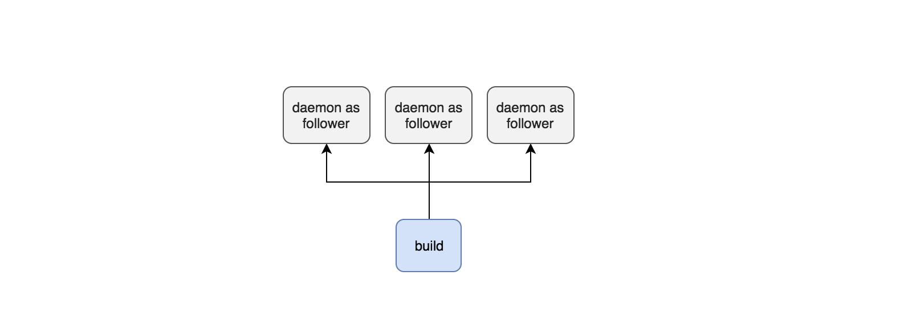

### 通过BCS解决研发环境的资源复用

#### 1. 背景

研发环境的编译构建需要大量机器资源，在中大型公司中，不同部门、项目各自维护自己的构建资源往往存在一些问题：成本高、利用率低。


#### 2. 案例

在c/c++工程编译构建中，distcc是一个被广泛使用的分布式编译方案。主要原理是在一批机器上拉起daemon，作为编译时的从机，让构建能够分布式地使用从机的机器资源。



对于不同的build：

- 需要的follwer环境不尽相同，例如不同的gcc版本
- 需要的资源数量不同
- 有隔离的需求，不希望其他build抢占cpu
- 有鉴权的需求

因此容器化部署从机daemon是一个比较好的选择。上层服务提供编译构建接入，下层则由BCS来提供构建容器的管理、资源监控、服务导出等服务。


#### 3. 方案

以bcs-mesos方案为例

##### 3.1 资源管理与监控

集群内的所有物理母机，往往存在异构的情况。如有些机器是带SSD的，适合对磁盘性能敏感的构建使用；有些机器是有地域区分的，适合对网络传输效率敏感的构建就近接入。

针对这类需求，可以通过对物理母机打上标签(tag)，来作为调度时的一类条件。

通过client命令行为slave机器添加tag。

```bash
bcs-client as -u -k storageType --string SSD --ip 127.0.0.1
bcs-client as -u -k city --string shenzhen --ip 127.0.0.1
```

通过client SDK为slave机器添加tag。

```golang
# scheduler/v4
UpdateStringAgentSetting(clusterID string, ipList []string, key, value string) error
```


为了保证用户构建的资源独占性和稳定性，在可调度资源耗尽的情况下，不应该再创建新的容器。

上层服务可以通过查询当前资源情况作为判断依据。

通过client命令行查询当前调度资源。

```bash
bcs-client offer
INDEX IP        Hostname  CPUS  MEM      DISK      CITY     IPRESOURCES  PORTS
1     127.0.0.1 slave1    24.00 78203.00 233317.00 shenzhen 0            31000-32000
2     127.0.0.2 slave2    24.00 78203.00 233317.00 shanghai 0            31000-32000
3     127.0.0.3 slave3    24.00 78203.00 233317.00 chengdu  0            31000-32000
```

通过client命令行查询当前机器tag。

```bash
bcs-client as -l
INDEX IP        Hostname disabled |string: city       storageType    
0     127.0.0.1 slave1   false    |        shanghai   SSD
1     127.0.0.2 slave2   false    |        shenzhen   NORMAL
```

通过client SDK查询机器tag和资源。

```golang
# scheduler/v4
ListAgentInfo(clusterID string, ipList []string) ([]*commonTypes.BcsClusterAgentInfo, error)

ListAgentSetting(clusterID string, ipList []string) ([]*commonTypes.BcsClusterAgentSetting, error)
```


##### 3.2 创建容器与调度

在上层服务创建容器时，可以设置亲和性调度，让容器在符合条件的物理母机上启动。

如当有来自深圳地区的构建发起时，上层服务可以在application.json中设置亲和性，将容器调度到tag为`city: shenzhen`的物理母机上，就近接入。

```json
{
  ...
  "constraint": {
    "intersectionItem": [
      {
        "unionData": [
          {
            "name": "city",
            "operate": "LIKE",
            "type": 3,
            "text": {
              "value": "shenzhen"
            }
          }
        ]
      }
    ]
  },
  ...
}
```

对distcc daemon而言，需要指定接入的客户机IP，来作为白名单限制，可以通过BCS在容器环境变量里传入。

同时，由于一台物理母机上会有多个daemon容器，端口不能写死，可以指定hostPort为0，让BCS负责分配随机的端口，使用host网络模式。

```json
{
  ...
  "spec": {
    "template": {
      "spec": {
        "containers": [
          {
            "type": "MESOS",
            "env": [
              {
                "name": "BK_DISTCC_ALLOW",
                "value": "127.0.0.1"
              }
			],
			"ports": [
              {
                "hostPort": 0,
                "name": "SERVICE_PORT",
                "protocol": "http"
              },
              {
                "hostPort": 0,
                "name": "STATS_PORT",
                "protocol": "http"
              }
            ]
          }
        ]
	  }
    }
  }
  ...
}
```


##### 3.3 服务发现与导出

上层服务通过BCS创建好一批daemon之后，需要发现并导出对应的服务地址，以供客户端连接。

通过client命令行查询容器的IP和端口

```bash
# 查询创建的application
bcs-client list -t app -ns distcc
NAME   STATUS  INSTANCE RUNNING_INSTANCE MESSAGE    CREATETIME    NAMESPACE
Build1 Running 10       10               ...running 2019-07-03... distcc

# 查询该application下的taskgroup(即pod)
bcs-client list -t tg -ns distcc | grep Build1
NAME                                      RC_NAME STATUS  CONTAINER_NUM ...
0.Build1.distcc.30000.1562144010015189503 Build1  Running 1             ...
1.Build1.distcc.30000.1562144010015189503 Build1  Running 1             ...
2.Build1.distcc.30000.1562144010015189503 Build1  Running 1             ...
...

# 查看其中一个taskgroup(即pod)的详细信息
bcs-client inspect -t tg -ns distcc -n 0.Build1.distcc.30000.1562144010015189503
{
	...
	"rcname": "Build1",
	"status": "Running",
	"lastStatus": "Starting",
	"hostIP": "127.0.0.7",
	"containerStatuses": [
		{
			"containerPort": [
				{
					"name": "SERVICE_PORT",
					"hostPort": 31000,
					"containerPort": 31000,
					"protocol": "http"
				},
				{
					"name": "STATS_PORT",
					"hostPort": 31001,
					"containerPort": 31001,
					"protocol": "http"
				}
			],
			"networkMode": "HOST"
        }
   ]
   ...
}
```

通过client SDK查询容器的具体信息

```golang
# storage/v1
ListApplication(clusterID string, condition url.Values) (ApplicationList, error)

ListTaskGroup(clusterID string, condition url.Values) (TaskGroupList, error)

InspectTaskGroup(clusterID, namespace, name string) (*TaskGroupSet, error)
```


##### 3.4 metrics

distcc daemon提供了stats http server来提供实时状态查询，需要定时查询统计，以追踪编译过程中的资源使用、编译文件数量等情况。

BCS提供了基于labels的metrics采集服务。

在下发的application的label中添加一个标记，如`metric_key: distcc`

通过bcs-client命令行创建一个metric，并关联到有这个label标记的application。

```bash
bcs-client metric -u -f metric.json
```

metric.json

```json
{
  "name": "distcc_metric",                      // metric名字
  "namespace": "distcc",                        // metric所在的namespace
  "clusterID": "BCS-MESOS-10001",               // metric所在的clusterID
  "clusterType": "mesos",                       // mesos集群则填写mesos
  
  "frequency": 60,                              // metric采集频率，单位秒
  "method": "GET",                              // metric采集的http方法
  "uri": "/get_metric",                         // metric采集uri
  "port": 31001,                                // metric采集端口
  
  "imageBase": "hub.docker.com",                 // 所在环境的镜像domain，跟业务容器保持一致
  "networkType": "cnm",                         // 采集容器networkType，跟业务容器保持一致
  "networkMode": "BRIDGE",                      // 采集容器networkMode，跟业务容器保持一致
  
  "selector": {                                 
    "metric_key": "distcc"
  },                                            // metric的配对label。当同clusterID且同namespace下的业务容器也含有此label时，业务容器将被列入采集对象
  "head": {
    "foo": "bar"
  },                                            // 采集时附带的http head
  "timeout": 0                                  // 采集超时时间，0则不限制超时，单位秒
}
```

通过client SDK创建一个metric。

```golang
# metric/v1
Upsert(clusterType string, data []byte) error
```


#### 4. 总结

以BCS为基础，可以搭建一套统一资源池的分布式构建服务。更多功能及使用方法可以查看bcs-client源代码。