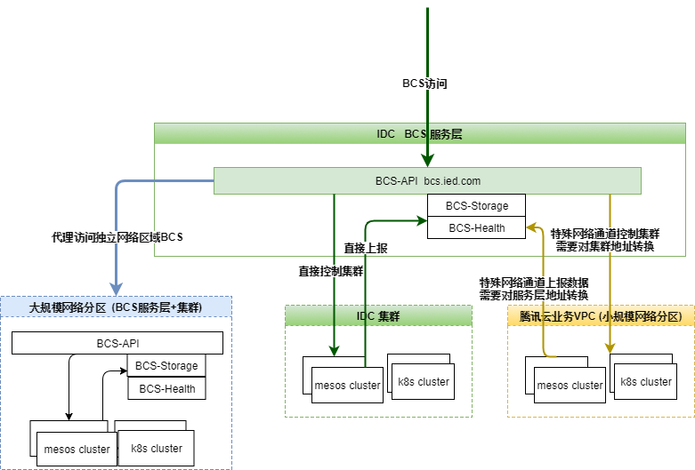

### BCS跨云容器管理方案

BCS跨云容器管理方案，旨在基于一套统一的接入层，来管控处于不同网络分区或云环境下的多个集群。

##### 1. 一般情况

一般的，在同一个网络环境下，BCS分为服务层和集群层，服务层与集群层之间网络互通，通过各个组件上报至zookeeper的IP来实现服务发现，下行命令通道和上行上报通道都能直接访问目标，如图绿色部分。

##### 2. 小规模网络分区

特别的，当出现小规模网络分区部署集群的需求时，集群层和服务层不在同一个网络环境下，需要人为地打通特殊网络通道，并对上下行的目标地址做地址转换。集群层组件需要配置：

1. 配置下行代理地址作为自己的服务地址，上报到zookeeper以供服务层发现
2. 配置上行代理地址作为需要访问的服务层组件的地址，以取代从zookeeper从获取

服务层组件无需处理，如图黄色部分。

##### 3. 大规模网络分区

当出现大规模网络分区，如在公有云环境上有大量的集群部署需求，人为处理每个集群网络的成本变得不可接受。在公有云环境下，可以搭建一套完整的BCS服务（包含服务层与集群层），使其能够在自身的网络环境中自洽运行。同时在接入层的BCS-API配置访问独立网络区域的代理，将指定集群的命令与请求都转发到对应的BCS子服务上，如图蓝色部分。