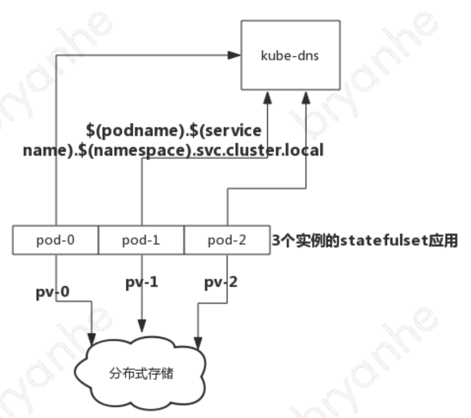
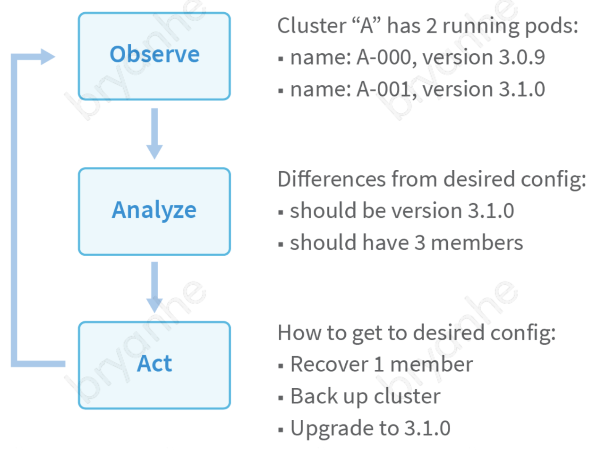
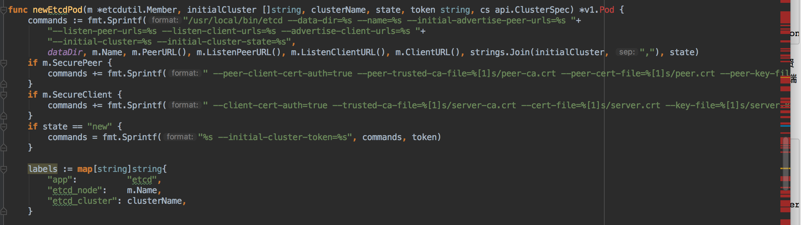

## 在 kubernetes 上运行有状态应用

自从 docker 引领容器技术革命以来，kubernetes 逐渐成为了容器编排领域的事实标准。使用 docker 作为容器的运行时，通过 kubernetes 来进行容器的编排和调度，正在被大多数企业作为基础设施云化的方案。容器被认为天生适合无状态应用如 web server，但对于有状态应用如数据库、redis 等的容器化，一直都备受争议，即使有些企业对如 mysql 进行了 docker 容器化，但大多数时候仍然是把 docker 容器当作虚拟机来使用，无法使用到 kubernetes 容器编排的诸多特性，灵活性和收益大打折扣。

### 无状态应用和有状态应用

- 无状态应用  
无状态应用 (stateless service) ，即 web 服务器、应用程序代码和代理类的应用程序，它们接收外部请求及处理数据但并不进行存储，而是通过向外部数据服务如数据库 mysql 、缓存 redis 等请求、修改和存储数据。即使公司内部遗留的一些比较老的需要存储和读写数据文件的有状态应用，也可以通过使用 s3 对象存储来完成无状态改造。  
无状态应用易于部署易于扩展，只需随着请求量的上升而相应地增加应用的实例数即可，而且在运行过程中可以随时被替换，几乎没有切换成本。而 docker 容器所具有的生命周期短暂、build once run anywhere 的特性，刚好天然适合无状态应用。  
随着 IT 基础设施的发展，存储与计算资源分离技术的日益成熟，相信更多的应用都会往无状态应用发展。

- 有状态应用  
不同于无状态应用，有状态应用 (stateless service) 的每个运行实例都具有自己的状态(差异)，它们或者需要从其它节点进行同步或复制数据，或者各节点间具有 master-slave 的角色，如果某个应用实例崩溃了，就会造成状态或数据的丢失。  
如 mysql 主备服务，slave 节点每次启动时需要从 master 节点同步数据，而当 master 节点有写入时，master 节点需要通过 binlog 往 slave 节点同步数据。又如 redis 集群，由至少 6 的偶数个节点构成一个集群，每个 master 对应一个 slave 节点，sharding 分片时采用 slot(槽) 的概念，不同的master-slave 节点组分配不同的 slot。这样，每个节点都有自己的状态，当集群中某个节点挂掉时，往集群中加入新的节点后还要做更多的额外运维操作才能恢复集群。  
由此可看出，对于这类有状态应用，想要使用容器化部署，是个很大的难题。  

随着 kubernetes 社区的快速发展，对有状态应用的支持方案也越来越成熟。目前，想在 kubernetes 集群上部署一套高可用、可扩展的有状态服务，可以使用 StatefulSet 和 Operator 两种方式。  

### 使用 StatefulSet 管理有状态应用

在 kubernetes 中，Deployment 或 ReplicationController 是用来管理无状态应用的 API 对象，而 StatefulSet 就是用来管理有状态应用的 API 对象。  
StatefulSet 用来管理一组 Pod 的部署和扩展，不同于 Deployment 的是，StatefulSet 下的每一个 Pod 都有唯一且持久的标识，即使被重新调度了，也会保留这个标识。  
StatefulSet 对于具有以下需求的有状态应用特别有意义：  
- 应用的每个实例需要有稳定、唯一的网络标识符
- 应用的每个实例需要有稳定、持久的存储
- 应用实例的部署和扩展是有序的
- 应用实例的滚动更新是有序的

下面是一个 StatefulSet 的示例：  
```
apiVersion: v1
kind: Service
metadata:
  name: nginx
  labels:
    app: nginx
spec:
  ports:
  - port: 80
    name: web
  clusterIP: None
  selector:
    app: nginx
---
apiVersion: apps/v1
kind: StatefulSet
metadata:
  name: web
spec:
  selector:
    matchLabels:
      app: nginx # has to match .spec.template.metadata.labels
  serviceName: "nginx"
  replicas: 3 # by default is 1
  template:
    metadata:
      labels:
        app: nginx # has to match .spec.selector.matchLabels
    spec:
      terminationGracePeriodSeconds: 10
      containers:
      - name: nginx
        image: k8s.gcr.io/nginx-slim:0.8
        ports:
        - containerPort: 80
          name: web
        volumeMounts:
        - name: www
          mountPath: /usr/share/nginx/html
  volumeClaimTemplates:
  - metadata:
      name: www
    spec:
      accessModes: [ "ReadWriteOnce" ]
      storageClassName: "my-storage-class"
      resources:
        requests:
          storage: 1Gi
```

对于一个有 N 个 Pod 实例的 StatefulSet ，每一个 Pod 实例都分配一个唯一的整数序号，从 0 到 N-1 。StatefulSet 中的每个 Pod 都从 StatefulSet 的名称和其序号中获取其主机名和 Pod 名。Pod 名和其主机名的模式是 $(statefulset name)-$(ordinal) 。对于上例来说，3 个 Pod 的名称分别为 web-0, web-1, web-2 。  

#### StatefulSet 实例的网络标识
StatefulSet 可以使用 Headless Service 来控制其 Pods 的域名。Headless Service 是一种 spec.clusterIp 的类型为 None 的 Service ，这种 Service 不会被分配 cluster ip ，kube-proxy 也不会处理这种 Service 。  
StatefulSet 对应的 Headless Service 的域名形式为 $(service name).$(namespace).svc.cluster.local ，StatefulSet 中的每一个 Pod ，都有一个单独的域名，形式为 $(podname).$(service name).$(namespace).svc.cluster.local 。  
对于上例来说，3 个 Pod 的域名分别为 web-0.nginx.default.svc.cluster.local , web-1.nginx.default.svc.cluster.local , web-2.nginx.default.svc.cluster.local 。  
使用 StatefulSet 和 Headless Service 后，有状态应用可以轻松在程序中通过 kube-dns 提供的服务注册发现能力，使用 Pod 实例的域名来彼此访问。当 pod 被重新调度时，pod 的 ip 可能会变，但每个 pod 对应的域名是不变的，所以能保证稳定的网络。  

#### StatefulSet 的存储标识
StatefulSet 中 Pod 实例的存储必须基于动态的 StorageClass 来提供。在 StatefulSet 中，使用 VolumeClaimTemplates 来动态创建 PVC ，kubernetes 为每个 VolumeClaimTemplates 创建一个 PV 。在上面的示例中，每个 Pod 都将获得基于 my-storage-class 创建的一个 1G 大小的 PV 。如果 Pod 被重新调度，新创建的这个 Pod 仍将绑定之前那个 PVC 及其 PV ，这能够保证数据的稳定性。  

#### 部署和滚动更新
StatefulSet 在部署和删除时，其 Pod 实例的添加和删除都是有序的。在 Pod 实例生成时，从 0 到 N-1 逐个创建，在删除 Pod 实例时，从 N-1 到 0 逐个删除。在新增一个 Pod 时，其所有前续 Pods 都必须处于 running 和 ready 状态，在终止一个 Pod 前，其后续 Pods 都必须已经完全停止。  
在 StatefulSet 进行滚动更新时，遵循与 Pod 删除同样逻辑。每次更新一个 Pod 前，必须等待其后续 Pod 已经更新完毕。  

#### StatefulSet 管理有状态应用的利弊




参考如上图的架构图，StatefulSet 作为 kubernetes 官方推出的管理有状态应用的 API 资源对象，具有较清晰和简单的结构，对于简单的有状态应用来说，是十分有用的部署管理方案。  

kubernetes 官方给出了众多的 StatefulSet 有状态应用的容器化示例，如：  

- [在 kubernetes 上运行 mysql 主从集群](https://kubernetes.io/docs/tasks/run-application/run-replicated-stateful-application/)
- [在 kubernetes 上运行 redis 主从哨兵集群](https://github.com/kubernetes/examples/blob/master/staging/storage/redis/README.md)

这类有状态应用示例基本上是使用 statefulset 的稳定持久化存储和稳定网络标志的特性，然后在 pod 中通过 init-container 来实现 pod 启动时的数据复制，或者通过在 slave pod 实例中配置一个启动了数据同步工具的容器来完成从 master pod 实例中实时同步数据。  
但由于这类 statefulset 应用大多在 pod 中启动了数据复制或同步的工具，灵活性有所下降，对于运维来说并不便于管理和控制。

### Opertator, 在 kubernetes 上运行有状态应用的利器

#### Opetrator概念
operator 是 coreos 公司推出的旨在简化有状态应用的管理的框架，它其实是针对有状态应用的一种专门的自动化方案。operator 的核心在于自动化，因为像我们上文提及到的如 mysql, redis 以及 etcd 等有状态应用，它们有复杂的运维和逻辑在里面，并且会根据环境和角色的不同而做一些不同的重复性的工作，而 operator 就是这样一种概念，它会模拟运维人员，不断的去更新和配置，来保证集群和服务的正常运行。因此，本质上来说，operator 是一个感知 kubernetes 上的应用状态的控制器，它把管理应用状态的所有操作封装到配置资源和控制器中，实现有状态应用的自动化管理。  
operator 的工作原理如下图所示：  


operator 通过以下三个步骤来模拟运维人员的行为：  

- 观察：首先，它通过 kubernetes 的 api 观察有状态应用集群的当前状态；
- 分析：然后，它分析当前状态与期望状态的差异； 
- 操作：最后，它通过调用 kubernetes 的 api 以及 有状态应用的 api， 来使当前状态达到期望的状态，恢复集群。  

#### operator 的实现原理
这里以 etcd operator 为例来讲解 operator 的实现原理。

##### kubernetes CRD(CustomResourceDefinition)
自定义资源是对 kubernetes api 的扩展。kubernetes 的每种资源都对应一个 API 对象的集合，如 pod, deployment, statefulset 这些 kubernetes 的内建资源，每种资源都有对应的一套 api 集合来进行操作和调用，而 kubectl 命令工具正是封装了对这些资源的 api 调用。当我们想扩展 kubernetes api 时，可以通过自定义资源来实现。  
kubernetes 中包含一种内建的资源叫做 CRD, 可以用它来创建自定义资源。

##### etcd-operator的部署
如上所述，operator 是专门针对有状态应用的一种自动化解决方案，而 etcd-operator 就是针对 etcd 集群的一种实现。  
etcd-operator 自身以 deployment 方式部署。etcd-operator 部署完后，会自动在 kubernetes 集群中创建 CRD 资源：  

```
$ kubectl get customresourcedefinitions
NAME                                    KIND
etcdclusters.etcd.database.coreos.com   CustomResourceDefinition.v1beta1.apiextensions.k8s.io
```
这样，etcd-operator 就在 kubernetes 集群中创建了一种 kind 为 EtcdCluster 的资源，同时 etcd-operator 会不断通过 kubernetes 的 client-go api 来 watch 这种后端资源的变化。  

##### 创建 etcd 集群
当在 kubernetes 集群中通过 kubectl apply 以下 yaml 文件:  

```
apiVersion: "etcd.database.coreos.com/v1beta2"
kind: "EtcdCluster"
metadata:
  name: "example-etcd-cluster"
  ## Adding this annotation make this cluster managed by clusterwide operators
  ## namespaced operators ignore it
  # annotations:
  #   etcd.database.coreos.com/scope: clusterwide
spec:
  size: 3
  version: "3.2.13"
```
创建一个 etcd cluster 集群后，etcd-operator 作为一个 kubernetes 的 controller 会 watch 到该事件，然后调用 kubernetes 的 api ，以 etcd 3.2.13 版本的镜像依次创建 3 个 pod 实例。etcd-operator 会获取并记录这 3 个 etcd pod 实例的 ip 地址，在启动 etcd 进程时使用这些 ip 地址构建一个具有 3 个节点的 etcd 集群。 

```
$ kubectl get pods
NAME                            READY     STATUS    RESTARTS   AGE
example-etcd-cluster-gxkmr9ql7z   1/1       Running   0          1m
example-etcd-cluster-m6g62x6mwc   1/1       Running   0          1m
example-etcd-cluster-rqk62l46kw   1/1       Running   0          1m
``` 
etcd-operator 创建 etcd pod 实例并配置 etcd 启动参数的代码示例如下：  


##### etcd 集群的状态变更
当 etcd 集群构建完成后，etcd-operator 会继续 watch kubernetes 上的 EtcdCluster 资源的事件，当该集群的某个 pod 挂掉后，etcd-operator 会分析出当前状态比期望的状态少一个 pod 实例，从而触发调用 kubernetes 的 api 再次创建一个新的 pod 。  
而当用户把上面的 yaml 文件 的 size 改为 5, 然后重新 kubectl apply 后，etcd-operator 会 watch 到该事件，发现该集群的期望状态是 5 个 节点，而实际的当前状态是 3 个节点，因此会触发调用 kubernetes 的 api 去再次创建 2 个 etcd pod 实例并加入集群，实现集群的扩容。  

##### etcd 集群的备份和恢复
etcd-operator 还同步提供了 backup-operator 和 restore-operator。 backup-operator 可以用于定时把 etcd 集群的数据备份到 s3 对象存储上，而 restore-backup 则可以使用 s3 上备份的数据重建一个 etcd 集群。

#### operator 理念
通过 etcd-operator 的实现原理可知，operator 主要做的就是三件事：

- 创建 kubernetes CRD
- watch 集群中 CRD 资源实例的变化事件
- 根据 CRD 资源实例的事件，调整应用的状态，如增删应用实例的数量、完成数据的复制或同步工作

operator 的核心理念就是把有状态应用的管理和维护工作自动化，做到像无状态应用一样，运维人员无需关心集群上应用实例的状态的变更。

### bcs 对有状态应用的支持
蓝鲸容器平台 BCS 完美继承了 kubernetes 上运行有状态应用的方案，通过 BCS ，用户不仅可以通过 bcs-api 部署和管理多个 kubernetes 集群的 StatefulSet 应用和 Operator 应用，还可以使用模板集、helm 等多种方式来进行管理，对复杂应用的管理提供了更大的便捷性。