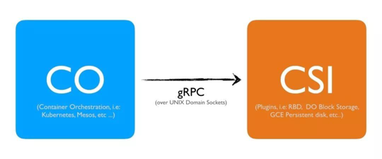
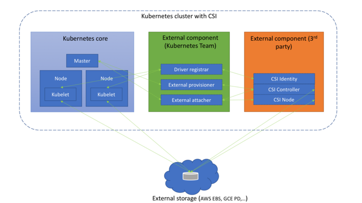
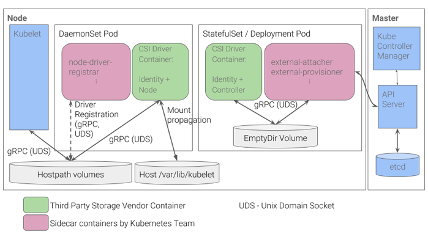

## CSI 介绍
CSI是由来自Kubernetes、Mesos、 Cloud Foundry等社区的member联合制定的一个行业标准接口规范，旨在将任意存储系统暴露给容器化应用程序。CSI规范定义了存储提供商（SP）实现CSI兼容插件的最小操作集和部署建议。CSI规范的主要焦点是声明插件必须实现的接口。   
CSI 使用 gprc 在容器编排系统与 CSI 插件之间进行交互：  


在 kubernetes 上整合 CSI 的架构可参考下图：  

  

如图所示，kubernetes CSI 存储体系主要由两部分组成：  
- kubernetes 外部组件：  
包含 Driver registrar , External provisioner , External attacher 三部分。这三个组件是从 kubernetes 原本的 in-tree 存储体系中剥离出来的存储管理功能，实质上是 kubernetes 中的一种外部 controller ，它们 watch kubernetes 的 API 资源对象，根据 watch 到的状态来调用下面提到的第二部分的 CSI 插件来实现存储的管理和操作。  
- CSI 存储插件
这部分正是需要编写代码实现的 CSI 插件，主要包含三部分：CSI Identity , CSI Controller , CSI Node 。  

## 编写 CSI 插件
CSI 插件的三部分 CSI Identity , CSI Controller , CSI Node 可放在同一个二进制程序中实现。每一部分都需要实现一些约定的接口，下面以 csi-driver-host-path 为例，来分别讲解这三部分功能的代码实现。  
csi-driver-host-path 是社区实现的一个 CSI 插件的示例，它以 hostpath 为后端存储，kubernetes 通过这个 CSI 插件 driver 来对接 hostpath ，管理本地 Node 节点上的存储卷。  
[项目源码](https://github.com/kubernetes-csi/csi-driver-host-path)  

### 定义 gRPC server
CSI 插件与 kubelet 以及 kubernetes 外部组件是通过 Unix Domani Socket gRPC 来进行交互调用的，实现 CSI 插件时需要先定义 gRPC server ，并注册给 CSI 。  

pkg/hostpath/hostpath.go
```
func (hp *hostPath) Run() {
	// Create GRPC servers
	hp.ids = NewIdentityServer(hp.name, hp.version)
	hp.ns = NewNodeServer(hp.nodeID, hp.ephemeral)
	hp.cs = NewControllerServer(hp.ephemeral)

	s := NewNonBlockingGRPCServer()
	s.Start(hp.endpoint, hp.ids, hp.cs, hp.ns)
	s.Wait()
}
```

pkg/hostpath/server.go
```
func (s *nonBlockingGRPCServer) serve(endpoint string, ids csi.IdentityServer, cs csi.ControllerServer, ns csi.NodeServer) {

	proto, addr, err := parseEndpoint(endpoint)
	if err != nil {
		glog.Fatal(err.Error())
	}

	if proto == "unix" {
		addr = "/" + addr
		if err := os.Remove(addr); err != nil && !os.IsNotExist(err) { //nolint: vetshadow
			glog.Fatalf("Failed to remove %s, error: %s", addr, err.Error())
		}
	}

	listener, err := net.Listen(proto, addr)
	if err != nil {
		glog.Fatalf("Failed to listen: %v", err)
	}

	opts := []grpc.ServerOption{
		grpc.UnaryInterceptor(logGRPC),
	}
	server := grpc.NewServer(opts...)
	s.server = server

	if ids != nil {
		csi.RegisterIdentityServer(server, ids)
	}
	if cs != nil {
		csi.RegisterControllerServer(server, cs)
	}
	if ns != nil {
		csi.RegisterNodeServer(server, ns)
	}

	glog.Infof("Listening for connections on address: %#v", listener.Addr())

	server.Serve(listener)

}
```

### CSI Identity 
CSI Identity 用于认证driver的身份信息，由上面提到的 kubernetes 外部组件调用，返回 CSI driver 的身份信息和健康状态。  
它需要实现以下的接口：  
```
service Identity {
   // return the version and name of the plugin
   rpc GetPluginInfo(GetPluginInfoRequest)
       returns (GetPluginInfoResponse) {}
   // reports whether the plugin has the ability of serving the Controller interface
   rpc GetPluginCapabilities(GetPluginCapabilitiesRequest)
       returns (GetPluginCapabilitiesResponse) {}
   // called by the CO just to check whether the plugin is running or not
   rpc Probe (ProbeRequest)
       returns (ProbeResponse) {}
}
```

kubernetes 外部组件如 External provisioner , External attacher 会调用这几个接口。其中，GetPluginInfo 返回这个插件的名字和版本号，GetPluginCapabilities 返回这个插件的包含的功能，比如非块存储类型的 CSI 插件不需要实现 Attach 功能，GetPluginCapabilities 就可以在返回中标注这个 CSI 插件不包含 Attach 功能。  
csi-driver-host-path 中对 CSI Identity 的实现如下：  

pkg/hostpath/identityserver.go
```
func NewIdentityServer(name, version string) *identityServer {
	return &identityServer{
		name:    name,
		version: version,
	}
}

func (ids *identityServer) GetPluginInfo(ctx context.Context, req *csi.GetPluginInfoRequest) (*csi.GetPluginInfoResponse, error) {
	glog.V(5).Infof("Using default GetPluginInfo")

	if ids.name == "" {
		return nil, status.Error(codes.Unavailable, "Driver name not configured")
	}

	if ids.version == "" {
		return nil, status.Error(codes.Unavailable, "Driver is missing version")
	}

	return &csi.GetPluginInfoResponse{
		Name:          ids.name,
		VendorVersion: ids.version,
	}, nil
}

func (ids *identityServer) Probe(ctx context.Context, req *csi.ProbeRequest) (*csi.ProbeResponse, error) {
	return &csi.ProbeResponse{}, nil
}

func (ids *identityServer) GetPluginCapabilities(ctx context.Context, req *csi.GetPluginCapabilitiesRequest) (*csi.GetPluginCapabilitiesResponse, error) {
	glog.V(5).Infof("Using default capabilities")
	return &csi.GetPluginCapabilitiesResponse{
		Capabilities: []*csi.PluginCapability{
			{
				Type: &csi.PluginCapability_Service_{
					Service: &csi.PluginCapability_Service{
						Type: csi.PluginCapability_Service_CONTROLLER_SERVICE,
					},
				},
			},
		},
	}, nil
}
```

### CSI Controller
CSI Controller 主要实现 Volume 管理流程当中的 "Provision" 和 "Attach" 阶段。  
"Provision" 阶段是指创建和删除 Volume 的流程，而 "Attach" 阶段是指把存储卷附着在某个 Node 或脱离某个 Node 的流程。只有块存储类型的 CSI 插件才需要 "Attach" 功能。  
CSI Controller 需要实现以下的接口：  

```
service Controller {
   // provisions a volume
   rpc CreateVolume (CreateVolumeRequest)
       returns (CreateVolumeResponse) {}

   // deletes a previously provisioned volume
   rpc DeleteVolume (DeleteVolumeRequest)
       returns (DeleteVolumeResponse) {}

   // make a volume available on some required node
   rpc ControllerPublishVolume (ControllerPublishVolumeRequest)
       returns (ControllerPublishVolumeResponse) {}

   // make a volume un-available on some required node
   rpc ControllerUnpublishVolume (ControllerUnpublishVolumeRequest)
       returns (ControllerUnpublishVolumeResponse) {}

   ...
   ...
}
```
其中，CreateVolume 和 DeleteVolume 是实现 "Provision" 阶段需要实现的接口，External provisioner 组件会 CSI 插件的这个接口以创建或者删除存储卷。ControllerPublishVolume 和 ControllerUnpublishVolume 是实现 "Attach" 阶段需要实现的接口，External attach 组件会调用 CSI 插件实现的这个接口以把某个块存储卷附着或脱离某个 Node 。  
如果想扩展 CSI 的功能，可以实现更多功能的接口，如快照功能的接口 CreateSnapshot 和 DeleteSnapshot。  
csi-driver-host-path 中对 CSI Controller 部分的实现如下：  

pkg/hostpath/controllerserver.go
```
func NewControllerServer(ephemeral bool) *controllerServer {
	if ephemeral {
		return &controllerServer{caps: getControllerServiceCapabilities(nil)}
	}
	return &controllerServer{
		caps: getControllerServiceCapabilities(
			[]csi.ControllerServiceCapability_RPC_Type{
				csi.ControllerServiceCapability_RPC_CREATE_DELETE_VOLUME,
				csi.ControllerServiceCapability_RPC_CREATE_DELETE_SNAPSHOT,
				csi.ControllerServiceCapability_RPC_LIST_SNAPSHOTS,
			}),
	}
}

func (cs *controllerServer) CreateVolume(ctx context.Context, req *csi.CreateVolumeRequest) (*csi.CreateVolumeResponse, error) {
	if err := cs.validateControllerServiceRequest(csi.ControllerServiceCapability_RPC_CREATE_DELETE_VOLUME); err != nil {
		glog.V(3).Infof("invalid create volume req: %v", req)
		return nil, err
	}

	// Check arguments
	if len(req.GetName()) == 0 {
		return nil, status.Error(codes.InvalidArgument, "Name missing in request")
	}
	caps := req.GetVolumeCapabilities()
	if caps == nil {
		return nil, status.Error(codes.InvalidArgument, "Volume Capabilities missing in request")
	}

	// Keep a record of the requested access types.
	var accessTypeMount, accessTypeBlock bool

	for _, cap := range caps {
		if cap.GetBlock() != nil {
			accessTypeBlock = true
		}
		if cap.GetMount() != nil {
			accessTypeMount = true
		}
	}
	// A real driver would also need to check that the other
	// fields in VolumeCapabilities are sane. The check above is
	// just enough to pass the "[Testpattern: Dynamic PV (block
	// volmode)] volumeMode should fail in binding dynamic
	// provisioned PV to PVC" storage E2E test.

	if accessTypeBlock && accessTypeMount {
		return nil, status.Error(codes.InvalidArgument, "cannot have both block and mount access type")
	}

	var requestedAccessType accessType

	if accessTypeBlock {
		requestedAccessType = blockAccess
	} else {
		// Default to mount.
		requestedAccessType = mountAccess
	}

	// Check for maximum available capacity
	capacity := int64(req.GetCapacityRange().GetRequiredBytes())
	if capacity >= maxStorageCapacity {
		return nil, status.Errorf(codes.OutOfRange, "Requested capacity %d exceeds maximum allowed %d", capacity, maxStorageCapacity)
	}

	// Need to check for already existing volume name, and if found
	// check for the requested capacity and already allocated capacity
	if exVol, err := getVolumeByName(req.GetName()); err == nil {
		// Since err is nil, it means the volume with the same name already exists
		// need to check if the size of exisiting volume is the same as in new
		// request
		if exVol.VolSize >= int64(req.GetCapacityRange().GetRequiredBytes()) {
			// exisiting volume is compatible with new request and should be reused.
			// TODO (sbezverk) Do I need to make sure that RBD volume still exists?
			return &csi.CreateVolumeResponse{
				Volume: &csi.Volume{
					VolumeId:      exVol.VolID,
					CapacityBytes: int64(exVol.VolSize),
					VolumeContext: req.GetParameters(),
				},
			}, nil
		}
		return nil, status.Error(codes.AlreadyExists, fmt.Sprintf("Volume with the same name: %s but with different size already exist", req.GetName()))
	}

	volumeID := uuid.NewUUID().String()
	path := getVolumePath(volumeID)

	if requestedAccessType == blockAccess {
		executor := utilexec.New()
		size := fmt.Sprintf("%dM", capacity/mib)
		// Create a block file.
		out, err := executor.Command("fallocate", "-l", size, path).CombinedOutput()
		if err != nil {
			glog.V(3).Infof("failed to create block device: %v", string(out))
			return nil, err
		}

		// Associate block file with the loop device.
		volPathHandler := volumepathhandler.VolumePathHandler{}
		_, err = volPathHandler.AttachFileDevice(path)
		if err != nil {
			glog.Errorf("failed to attach device: %v", err)
			// Remove the block file because it'll no longer be used again.
			if err2 := os.Remove(path); err != nil {
				glog.Errorf("failed to cleanup block file %s: %v", path, err2)
			}
			return nil, status.Error(codes.Internal, fmt.Sprintf("failed to attach device: %v", err))
		}
	}

	vol, err := createHostpathVolume(volumeID, req.GetName(), capacity, requestedAccessType)
	if err != nil {
		return nil, status.Error(codes.Internal, fmt.Sprintf("failed to create volume: %s", err))
	}
	glog.V(4).Infof("created volume %s at path %s", vol.VolID, vol.VolPath)

	if req.GetVolumeContentSource() != nil {
		contentSource := req.GetVolumeContentSource()
		if contentSource.GetSnapshot() != nil {
			snapshotId := contentSource.GetSnapshot().GetSnapshotId()
			snapshot, ok := hostPathVolumeSnapshots[snapshotId]
			if !ok {
				return nil, status.Errorf(codes.NotFound, "cannot find snapshot %v", snapshotId)
			}
			if snapshot.ReadyToUse != true {
				return nil, status.Errorf(codes.Internal, "Snapshot %v is not yet ready to use.", snapshotId)
			}
			snapshotPath := snapshot.Path
			args := []string{"zxvf", snapshotPath, "-C", path}
			executor := utilexec.New()
			out, err := executor.Command("tar", args...).CombinedOutput()
			if err != nil {
				return nil, status.Error(codes.Internal, fmt.Sprintf("failed pre-populate data for volume: %v: %s", err, out))
			}
		}
	}

	return &csi.CreateVolumeResponse{
		Volume: &csi.Volume{
			VolumeId:      volumeID,
			CapacityBytes: req.GetCapacityRange().GetRequiredBytes(),
			VolumeContext: req.GetParameters(),
		},
	}, nil
}

func (cs *controllerServer) DeleteVolume(ctx context.Context, req *csi.DeleteVolumeRequest) (*csi.DeleteVolumeResponse, error) {

	// Check arguments
	if len(req.GetVolumeId()) == 0 {
		return nil, status.Error(codes.InvalidArgument, "Volume ID missing in request")
	}

	if err := cs.validateControllerServiceRequest(csi.ControllerServiceCapability_RPC_CREATE_DELETE_VOLUME); err != nil {
		glog.V(3).Infof("invalid delete volume req: %v", req)
		return nil, err
	}

	vol, err := getVolumeByID(req.GetVolumeId())
	if err != nil {
		// Return OK if the volume is not found.
		return &csi.DeleteVolumeResponse{}, nil
	}
	glog.V(4).Infof("deleting volume %s", vol.VolID)

	if vol.VolAccessType == blockAccess {

		volPathHandler := volumepathhandler.VolumePathHandler{}
		// Get the associated loop device.
		device, err := volPathHandler.GetLoopDevice(getVolumePath(vol.VolID))
		if err != nil {
			return nil, status.Error(codes.Internal, fmt.Sprintf("failed to get the loop device: %v", err))
		}

		if device != "" {
			// Remove any associated loop device.
			glog.V(4).Infof("deleting loop device %s", device)
			if err := volPathHandler.RemoveLoopDevice(device); err != nil {
				return nil, status.Error(codes.Internal, fmt.Sprintf("failed to remove loop device: %v", err))
			}
		}
	}

	if err := deleteHostpathVolume(vol.VolID); err != nil && !os.IsNotExist(err) {
		return nil, status.Error(codes.Internal, fmt.Sprintf("failed to delete volume: %s", err))
	}

	glog.V(4).Infof("volume deleted ok: %s", vol.VolID)

	return &csi.DeleteVolumeResponse{}, nil
}
```

### CSI Node
CSI Node 部分主要负责 Volume 管理流程当中的 "Mount" 阶段，即把 Volume 挂载至 Pod 容器，或者从 Pod 中卸载 Volume 。在宿主机 Node 上需要执行的操作都包含在这个部分。  
CSI Node 需要实现的接口如下：  
```
service Node {
   // temporarily mount the volume to a staging path
   rpc NodeStageVolume (NodeStageVolumeRequest)
       returns (NodeStageVolumeResponse) {}

   // unmount the volume from staging path
   rpc NodeUnstageVolume (NodeUnstageVolumeRequest)
       returns (NodeUnstageVolumeResponse) {}

   // mount the volume from staging to target path
   rpc NodePublishVolume (NodePublishVolumeRequest)
       returns (NodePublishVolumeResponse) {}

   // unmount the volume from staging path
   rpc NodeUnpublishVolume (NodeUnpublishVolumeRequest)
       returns (NodeUnpublishVolumeResponse) {}

   // stats for the volume
   rpc NodeGetVolumeStats (NodeGetVolumeStatsRequest)
       returns (NodeGetVolumeStatsResponse) {}

   ...

   // Similar to NodeGetId
   rpc NodeGetInfo (NodeGetInfoRequest)
       returns (NodeGetInfoResponse) {}
}
```
kubelet 会调用 CSI 插件实现的接口，以实现 volume 的挂载和卸载。  
其中 Volume 的挂载被分成了 NodeStageVolume 和 NodePublishVolume 两个阶段。NodeStageVolume 接口主要是针对块存储类型的 CSI 插件而提供的。 块设备在 "Attach" 阶段被附着在 Node 上后，需要挂载至 Pod 对应目录上，但因为块设备在 linux 上只能 mount 一次，而在 kubernetes volume 的使用场景中，一个 volume 可能被挂载进同一个 Node 上的多个 Pod 实例中，所以这里提供了 NodeStageVolume 这个接口，使用这个接口把块设备格式化后先挂载至 Node 上的一个临时全局目录，然后再调用 NodePublishVolume 使用 linux 中的 bind mount 技术把这个全局目录挂载进 Pod 中对应的目录上。  
NodeUnstageVolume 和 NodeUnpublishVolume 正是 volume 卸载阶段所分别对应的上述两个流程。  
当然，如果是非块存储类型的 CSI 插件，也就不必实现 NodeStageVolume 和 NodeUnstageVolume 这两个接口了。  
csi-driver-host-path 中对 CSI Node 部分的实现如下：  

pkg/hostpath/nodeserver.go
```
func NewNodeServer(nodeId string, ephemeral bool) *nodeServer {
	return &nodeServer{
		nodeID:    nodeId,
		ephemeral: ephemeral,
	}
}

func (ns *nodeServer) NodePublishVolume(ctx context.Context, req *csi.NodePublishVolumeRequest) (*csi.NodePublishVolumeResponse, error) {

	// Check arguments
	if req.GetVolumeCapability() == nil {
		return nil, status.Error(codes.InvalidArgument, "Volume capability missing in request")
	}
	if len(req.GetVolumeId()) == 0 {
		return nil, status.Error(codes.InvalidArgument, "Volume ID missing in request")
	}
	if len(req.GetTargetPath()) == 0 {
		return nil, status.Error(codes.InvalidArgument, "Target path missing in request")
	}

	targetPath := req.GetTargetPath()

	if req.GetVolumeCapability().GetBlock() != nil &&
		req.GetVolumeCapability().GetMount() != nil {
		return nil, status.Error(codes.InvalidArgument, "cannot have both block and mount access type")
	}

	// if ephemeral is specified, create volume here to avoid errors
	if ns.ephemeral {
		volID := req.GetVolumeId()
		volName := fmt.Sprintf("ephemeral-%s", volID)
		vol, err := createHostpathVolume(req.GetVolumeId(), volName, maxStorageCapacity, mountAccess)
		if err != nil && !os.IsExist(err) {
			glog.Error("ephemeral mode failed to create volume: ", err)
			return nil, status.Error(codes.Internal, err.Error())
		}
		glog.V(4).Infof("ephemeral mode: created volume: %s", vol.VolPath)
	}

	vol, err := getVolumeByID(req.GetVolumeId())
	if err != nil {
		return nil, status.Error(codes.NotFound, err.Error())
	}

	if req.GetVolumeCapability().GetBlock() != nil {
		if vol.VolAccessType != blockAccess {
			return nil, status.Error(codes.InvalidArgument, "cannot publish a non-block volume as block volume")
		}

		volPathHandler := volumepathhandler.VolumePathHandler{}

		// Get loop device from the volume path.
		loopDevice, err := volPathHandler.GetLoopDevice(vol.VolPath)
		if err != nil {
			return nil, status.Error(codes.Internal, fmt.Sprintf("failed to get the loop device: %v", err))
		}

		mounter := mount.New("")

		// Check if the target path exists. Create if not present.
		_, err = os.Lstat(targetPath)
		if os.IsNotExist(err) {
			if err = mounter.MakeFile(targetPath); err != nil {
				return nil, status.Error(codes.Internal, fmt.Sprintf("failed to create target path: %s: %v", targetPath, err))
			}
		}
		if err != nil {
			return nil, status.Errorf(codes.Internal, "failed to check if the target block file exists: %v", err)
		}

		// Check if the target path is already mounted. Prevent remounting.
		notMount, err := mounter.IsNotMountPoint(targetPath)
		if err != nil {
			if !os.IsNotExist(err) {
				return nil, status.Errorf(codes.Internal, "error checking path %s for mount: %s", targetPath, err)
			}
			notMount = true
		}
		if !notMount {
			// It's already mounted.
			glog.V(5).Infof("Skipping bind-mounting subpath %s: already mounted", targetPath)
			return &csi.NodePublishVolumeResponse{}, nil
		}

		options := []string{"bind"}
		if err := mount.New("").Mount(loopDevice, targetPath, "", options); err != nil {
			return nil, status.Error(codes.Internal, fmt.Sprintf("failed to mount block device: %s at %s: %v", loopDevice, targetPath, err))
		}
	} else if req.GetVolumeCapability().GetMount() != nil {
		if vol.VolAccessType != mountAccess {
			return nil, status.Error(codes.InvalidArgument, "cannot publish a non-mount volume as mount volume")
		}

		notMnt, err := mount.New("").IsLikelyNotMountPoint(targetPath)
		if err != nil {
			if os.IsNotExist(err) {
				if err = os.MkdirAll(targetPath, 0750); err != nil {
					return nil, status.Error(codes.Internal, err.Error())
				}
				notMnt = true
			} else {
				return nil, status.Error(codes.Internal, err.Error())
			}
		}

		if !notMnt {
			return &csi.NodePublishVolumeResponse{}, nil
		}

		fsType := req.GetVolumeCapability().GetMount().GetFsType()

		deviceId := ""
		if req.GetPublishContext() != nil {
			deviceId = req.GetPublishContext()[deviceID]
		}

		readOnly := req.GetReadonly()
		volumeId := req.GetVolumeId()
		attrib := req.GetVolumeContext()
		mountFlags := req.GetVolumeCapability().GetMount().GetMountFlags()

		glog.V(4).Infof("target %v\nfstype %v\ndevice %v\nreadonly %v\nvolumeId %v\nattributes %v\nmountflags %v\n",
			targetPath, fsType, deviceId, readOnly, volumeId, attrib, mountFlags)

		options := []string{"bind"}
		if readOnly {
			options = append(options, "ro")
		}
		mounter := mount.New("")
		path := getVolumePath(volumeId)

		if err := mounter.Mount(path, targetPath, "", options); err != nil {
			var errList strings.Builder
			errList.WriteString(err.Error())
			if ns.ephemeral {
				if rmErr := os.RemoveAll(path); rmErr != nil && !os.IsNotExist(rmErr) {
					errList.WriteString(fmt.Sprintf(" :%s", rmErr.Error()))
				}
			}
		}
	}

	return &csi.NodePublishVolumeResponse{}, nil
}

func (ns *nodeServer) NodeUnpublishVolume(ctx context.Context, req *csi.NodeUnpublishVolumeRequest) (*csi.NodeUnpublishVolumeResponse, error) {

	// Check arguments
	if len(req.GetVolumeId()) == 0 {
		return nil, status.Error(codes.InvalidArgument, "Volume ID missing in request")
	}
	if len(req.GetTargetPath()) == 0 {
		return nil, status.Error(codes.InvalidArgument, "Target path missing in request")
	}
	targetPath := req.GetTargetPath()
	volumeID := req.GetVolumeId()

	vol, err := getVolumeByID(volumeID)
	if err != nil {
		return nil, status.Error(codes.NotFound, err.Error())
	}

	switch vol.VolAccessType {
	case blockAccess:
		// Unmount and delete the block file.
		err = mount.New("").Unmount(targetPath)
		if err != nil {
			return nil, status.Error(codes.Internal, err.Error())
		}
		if err = os.RemoveAll(targetPath); err != nil {
			return nil, status.Error(codes.Internal, err.Error())
		}
		glog.V(4).Infof("hostpath: volume %s has been unpublished.", targetPath)
	case mountAccess:
		// Unmounting the image
		err = mount.New("").Unmount(req.GetTargetPath())
		if err != nil {
			return nil, status.Error(codes.Internal, err.Error())
		}
		glog.V(4).Infof("hostpath: volume %s/%s has been unmounted.", targetPath, volumeID)
	}

	if ns.ephemeral {
		glog.V(4).Infof("deleting volume %s", volumeID)
		if err := deleteHostpathVolume(volumeID); err != nil && !os.IsNotExist(err) {
			return nil, status.Error(codes.Internal, fmt.Sprintf("failed to delete volume: %s", err))
		}
	}

	return &csi.NodeUnpublishVolumeResponse{}, nil
}

func (ns *nodeServer) NodeStageVolume(ctx context.Context, req *csi.NodeStageVolumeRequest) (*csi.NodeStageVolumeResponse, error) {

	// Check arguments
	if len(req.GetVolumeId()) == 0 {
		return nil, status.Error(codes.InvalidArgument, "Volume ID missing in request")
	}
	if len(req.GetStagingTargetPath()) == 0 {
		return nil, status.Error(codes.InvalidArgument, "Target path missing in request")
	}
	if req.GetVolumeCapability() == nil {
		return nil, status.Error(codes.InvalidArgument, "Volume Capability missing in request")
	}

	return &csi.NodeStageVolumeResponse{}, nil
}

func (ns *nodeServer) NodeUnstageVolume(ctx context.Context, req *csi.NodeUnstageVolumeRequest) (*csi.NodeUnstageVolumeResponse, error) {

	// Check arguments
	if len(req.GetVolumeId()) == 0 {
		return nil, status.Error(codes.InvalidArgument, "Volume ID missing in request")
	}
	if len(req.GetStagingTargetPath()) == 0 {
		return nil, status.Error(codes.InvalidArgument, "Target path missing in request")
	}

	return &csi.NodeUnstageVolumeResponse{}, nil
}
```

从上述代码中可以看到，因为 hostpath 非块存储类型的第三方存储，所以没有实现 NodeStageVolume 和 NodeUnstageVolume 这两个接口。  

## 部署 CSI 插件
编写完一个 CSI 插件后，就可以在 kubernetes 集群中部署这个 CSI 插件了。  
在 kubernetes 部署一个 CSI 插件的架构如下：  


CSI Controller 部分以 StatefulSet 方式部署，CSI Node 部分以 DaemonSet 方式部署。  
因为我们把这两部分实现在同一个 CSI 插件程序中，因此只需要把这个 CSI 插件与 External provisioner 、External attacher 以容器方式部署在同一个 StatefulSet 的 Pod中，把这个 CSI 插件与 Driver registrar 以容器方式部署在 DaemonSet 的 Pod 中，即可完成 CSI 的部署。  

## 总结
以上详细介绍了如何编写一个 CSI 插件并将其部署在 kubernetes 集群中的流程。因为 CSI 是一个复杂的存储架构，在实际开发和实现过程中肯定还会遇到各种各样的细节问题，需要读者自己去研究和排查，在纠错过程中加深自己的理解。  

