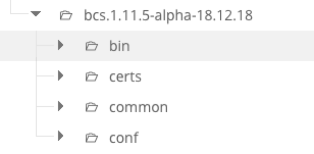

# bcs项目单机部署流程(mesos)

该文档说明

## 机器初始化
- 重装系统，CENTOS 7

## 部署步骤
- 部署zookeeper
- 部署bcs-api
- 部署bcs-storage
- 部署bcs-client
- 部署bcs-health
- 部署mesos-master
- 部署mesos-slave
- 部署bcs-container-executor
- 部署bcs-scheduler
- 部署bcs-mesos-driver
- 部署bcs-mesos-watch
- 部署bcs-check
- 部署bcs-dns

## 部署机器
假设提供的机器：

* hostname：$Hostname
* ip: $IP

## 部署目录
创建 /data/bcs目录，将所有程序包都部署在/data/bcs目录下

## bcs部署程序包
bcs部署需要多个程序包:

- docker.tar.gz
- java.tar.gz
- mesos-1.1.0.tar.gz
- zookeeper.tar.gz
- mongodb.tar.gz
- bcs.xx.xx.xx.tar.gz   //bcs模块程序包，例如：bcs.17.11.24.tar.gz

> NOTE: 上述程序包需要放到/data/bcs目录下面解压。

bcs.xx.xx.xx.tar.gz 模块程序包结构如下：


其中：bin目录下是模块的二进制文件；certs目录下是模块的https证书；conf目录下是模块的配置文件、脚本文件。

需要将上图中的结构转化为部署结构，如下面所示：

```
/data/bcs
    - bcs-api
         - bcs-api   // 上图 bcs/bin/bcs-api 文件
         - cert      //上图 bcs/certs/bcs-api/*  文件
         - *.template      //上图 bcs/conf/bcs-api/* 文件
    - bcs-storage    
         - bcs-storage // 上图 bcs/bin/bcs-storage 文件
         - conf       //上图 bcs/certs/bcs-storage/* 文件
         - *.template   //上图 bcs/conf/bcs-storage/* 文件
```
例如，生成bcs-api部署目录，其它模块类似

```
cd /data/bcs && mkdir bcs-api
rsync bcs.17.11.24/bin/bcs-api bcs-api/
rsync -a bcs.17.11.24/certs/bcs-api/* bcs-api/
rsync -a bcs.17.11.24/conf/bcs-api/* bcs-api/
```


## 单机部署

### zookeeper部署
需要版本：zookeeper-3.4.6

### bcs-api部署

#### bcs-api配置

config_files.json

```
service_config:
  address: 0.0.0.0
  port: 8082
  insecure_address: 0.0.0.0
  insecure_port: 8080
metric_config:
  metric_port: 8081
zk_config:
  bcs_zookeeper: $IP:2181
cert_config:
  ca_file: ./cert/bcs-inner-ca.crt
  server_cert_file: ./cert/bcs-inner-server.crt
  server_key_file: ./cert/bcs-inner-server.key
  client_cert_file: ./cert/bcs-inner-client.crt
  client_key_file: ./cert/bcs-inner-client.key
license_server_config:
  ls_address:
  ls_ca_file:
  ls_client_cert_file:
  ls_client_key_file:
log_config:
  log_dir: ./logs
  log_max_size: 500
  log_max_num: 10
  logtostderr: false
  alsologtostderr: false
  v: 0
  stderrthreshold: 2
  vmodule:
  log_backtrace_at:
process_config:
  pid_dir: ./pid
local_config:
  local_ip: $IP
bkiam_auth:
  auth: false
  apigw_rsa_file:
  auth_token_sync_time:
  bkiam_auth_host:
  bkiam_auth_app_code:
  bkiam_auth_app_secret:
  bkiam_auth_system_id:
  bkiam_auth_scope_id:
  bkiam_auth_zookeeper:

core_database:
  dsn:

component:
    paas_auth_host:
    paas_cc_host:
    paas_cc_apigw_env:
    paas_auth_subserver_host:

# bootstrap_users defines some admin users, it can be useful for bootstraping a new bke environment where no
# users exists in database
bootstrap_users:
  - name:
    is_super_user: true
    tokens:
      -
  - name:
    is_super_user: false
    tokens:
      -

# The credentials fixtures is a special type of cluster credentials, they are definded directly in config file and doesn't
# rely on any other storages.
#
# IMPORTANT: please do not use this config in production environment, because a cluster defined in fixture config can be
# accessed by any user without authorization.
cluster_credentials_fixtures:
  enabled: true
  credentials:
    - cluster_id: "localkube-fixed"
      type: service_account
      server: https://192.168.64.8:8443
      ca_cert: CA_CERT_FROM_CLUSTER_SECRETS
      token: TOKEN_FROM_CLUSTER_SECRETS

# rbac data
rbac:
  # 是否从paas-auth订阅 rbac 数据，默认true
  turn_on_auth: false
  # 是否从配置文件读取 rbac 数据，默认false
  turn_on_conf: false
  data:
  - username:
    cluster_id:
    roles:
      -
      -
  - username:
    cluster_id:
    roles:
      -
      -
```

#### 启动bcs-api

```
./start.sh
```


### bcs-storage部署

#### mongodb部署

```
mkdir -p /data/db
cd /data/bcs/mongodb
vim conf/mongodb.conf
```

修改配置为

```
dbpath=/data/db
logpath=/data/bcs/mongodb/logs/mongodb.log
fork=true
logappend=true
master=true
auth=false
```

启动mongodb

```
./bin/mongod -f ./conf/mongodb.conf &
```

登入mongodb

```
./bin/mongo
```

添加用户

```
use admin
db.createUser(
  {
    user: "storage",
    pwd: "storage-pwd",
    roles: [ { role: "root", db: "admin" } ]
  }
)
```

退出mongodb

```
exit
```

kill掉mongodb进程，并修改配置，启用auth

```
kill `ps -ef |grep mongodb |grep -v grep |awk '{print $2}'`

vim conf/mongodb.conf
```

```
dbpath=/data/db
logpath=/data/bcs/mongodb/logs/mongodb.log
fork=true
logappend=true
auth=true
```

启动mongodb

```
./bin/mongod -f ./conf/mongodb.conf &
```

尝试登入shell

```
./bin/mongo --port 27017 -u "storage" -p "storage-pwd" --authenticationDatabase "admin"
```

若成功登入则mongodb部署完成


#### bcs-storage配置

storage-database.conf

```
[mongodb/dynamic]
Addr = $IP
ConnectTimeout = 0
Database = dynamic
Username = storage
Password = UjLz7evjZXpYkIYAZuGs7A==
PoolWidth = 100

[mongodb/event]
Addr = $IP
ConnectTimeout = 0
Database = event
Username = storage
Password = UjLz7evjZXpYkIYAZuGs7A==

[mongodb/alarm]
Addr = $IP
ConnectTimeout = 0
Database = alarm
Username = storage
Password = UjLz7evjZXpYkIYAZuGs7A==

[mongodb/metric]
Addr = $IP
ConnectTimeout = 0
Database = metric
Username = storage
Password = UjLz7evjZXpYkIYAZuGs7A==

[mongodb/host]
Addr = $IP
ConnectTimeout = 0
Database = host
Username = storage
Password = UjLz7evjZXpYkIYAZuGs7A==

[mongodb/clusterConfig]
Addr = $IP
ConnectTimeout = 0
Database = clusterConfig
Username = storage
Password = UjLz7evjZXpYkIYAZuGs7A==

[zk/watch]
Addr = $IP
ConnectTimeout = 5
Database = etc/cluster
Username = 
Password =
```

config_file.json

```
{
  "address": "$IP",
  "port": 50040,
  "metric_port": 50041,
  "bcs_zookeeper": "$IP:2181",
  "database_config_file": "./storage-database.conf",
  "event_max_day": 1,
  "event_max_cap": 10000,
  "alarm_max_day": 1,
  "alarm_max_cap": 10000,
  "ca_file": "./cert/bcs-inner-ca.crt",
  "server_cert_file": "./cert/bcs-inner-server.crt",
  "server_key_file": "./cert/bcs-inner-server.key"
}
```
#### 启动bcs-storage


```bash
./start.sh
```

使用启动脚本拉起即可

观察```logs/bcs-storage.INFO```日志开头的db连接信息，

```
Begin to parse databases.
Complete parse mongodb config: mongodb/dynamic
Complete parse mongodb config: mongodb/event
Complete parse mongodb config: mongodb/alarm
Complete parse mongodb config: mongodb/clusterConfig
Complete parse zk config: zk/watch
Databases parsing completed.
```

一般来说db配置都解析／连接成功，bcs-storage即可正常工作


### bcs-client部署

解压安装包到制定安装目录

```
ln -s /data/bcs/bcs-client/bcs-client /usr/bin/bcs-client
mkdir /var/bcs
```
配置bcs-client配置文件/var/bcs/bcs.conf, 配置bcs-api地址

```
{
  "apiserver":"$IP:8080"
}
```
执行简单命令，验证服务正常

```
bcs-client export --clusterid BCS-AWSTEST-10001
bcs-client list -t app -ns test
```
输出如下，表示部署ok
```
Found no application.
```


### mesos-master部署

版本：1.1.0

目录：/data/bcs/mesos


### bcs-scheduler部署

#### bcs-scheduler配置

config_file.json

```
{
  "address": "$IP",
  "port": 9999,
  "metric_port": 10000,
  "bcs_zookeeper": "$IP:2181",
  "ca_file": "./cert/bcs-inner-ca.crt",
  "client_cert_file": "./cert/bcs-inner-client.crt",
  "client_key_file": "./cert/bcs-inner-client.key",
  "use_cache": false,
  "regdiscv": "$IP:2181",
  "mesos_regdiscv": "$IP:2181",
  "zkhost": "$IP:2181",
  "v": 3,
  "cluster": "BCS-TEST-10001"
}
```
#### 启动bcs-scheduler

```
./start.sh
```


### bcs-mesos-driver部署

#### bcs-mesos-driver配置

config_file.json

```
{
  "address": "$IP",
  "port": 50020,
  "metric_port": 50021,
  "bcs_zookeeper": "$IP:2181",
  "ca_file": "./cert/bcs-inner-ca.crt",
  "client_cert_file": "./cert/bcs-inner-client.crt",
  "client_key_file": "./cert/bcs-inner-client.key",
  "sched_regdiscv": "$IP:2181",
  "cluster": "BCS-TEST-10001",
  "v": 3
}
```
#### 启动bcs-mesos-driver
```
./start.sh
```


### bcs-mesos-watch部署

config_file.json

```
{
  "address": "$IP",
  "port": 50030,
  "metric_port": 50031,
  "bcs_zookeeper": "$IP:2181",
  "ca_file": "./cert/bcs-inner-ca.crt",
  "client_cert_file": "./cert/bcs-inner-client.crt",
  "client_key_file": "./cert/bcs-inner-client.key",
  "server_cert_file": "./cert/bcs-inner-server.crt",
  "server_key_file": "./cert/bcs-inner-server.key",
  "clusterinfo": "$IP:2181/blueking",
  "v": 3,
  "cluster": "BCS-TEST-10001"
}
```
#### 启动bcs-mesos-watch

```
./start.sh
```


### bcs-check部署
#### bcs-check配置

config_file.json

```
{
  "address": "$IP",
  "port": 43000,
  "metric_port": 43001,
  "bcs_zookeeper": "$IP:2181",
  "ca_file": "./cert/bcs-inner-ca.crt",
  "client_cert_file": "./cert/bcs-inner-client.crt",
  "client_key_file": "./cert/bcs-inner-client.key",
  "server_cert_file": "./cert/bcs-inner-server.crt",
  "server_key_file": "./cert/bcs-inner-server.key",
  "mesos_zookeeper": "$IP:2181"
}
```
#### 启动bcs-check

```
./start.sh
```


### mesos-slave部署

版本：1.1.0

目录：/data/bcs/mesos

### docker部署

版本：18.09.0

### bcs-container-executor部署

将可执行文件bcs-container-executor拷贝到指定安装路径：/data/bcs/mesos/libexec/mesos
bcs-container-executor文件在bcs模块程序包中的bin目录下
