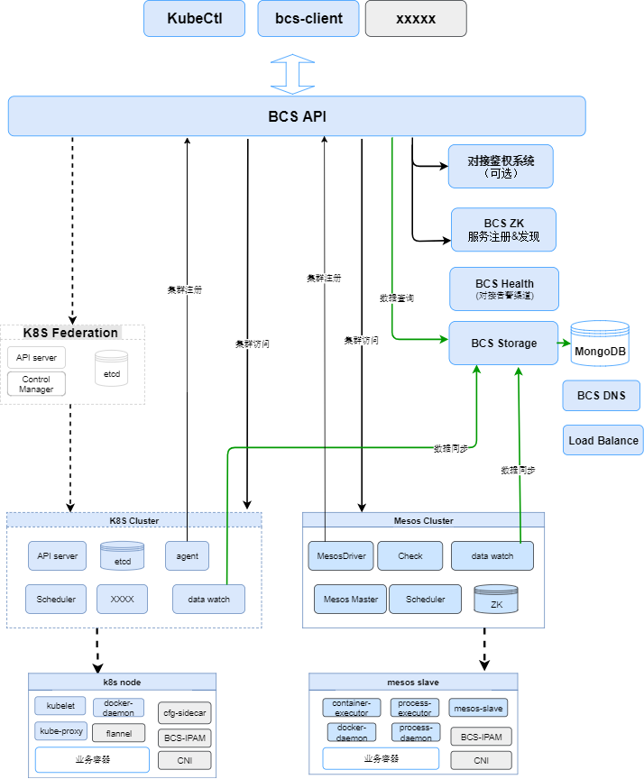

# 项目架构

BCS 是统一的容器部署管理解决方案，为了适应不同业务场景的需要，BCS 内部同时支持基于 Mesos 和基于 Kubernetes 的两种不同的实现。
下图为 BCS 以及 Mesos 集群的整体架构图：BCS Client 或者业务 SaaS 服务通过 API Gateway 接入，网关根据访问的集群将请求路由到下边的 Mesos 集群或者 Kubernetes 集群



对于每一个编排集群，通过 Data-Watch 组件将集群中所有数据同步给 BCS-Storage 服务并存储进 MongoDB 中。

BCS-Storage 即拥有全量数据，同时将数据写入 RabbitMQ 消息队列，供给需要数据流的服务使用(如 AlertManager 等)。对于通过网关进来的查询请求，也将落到 BCS-Storage 上，减轻下层集群的压力。

## 集群注册及访问

对于 Kubernetes 集群，KubeAgent 组件通过 Gateway 注册自身集群信息，数据存放进 Etcd 中；

对于 Mesos 集群，MesosDriver 组件直接向 Gateway 对应的 Etcd 注册自身集群信息。

### 集群访问

ClusterManager 作为集群管理组件，能够通过 Etcd 获取所有集群信息。 对于需要直连下层集群的请求，
可以通过 ClusterManager 获取到下层集群信息后，通过 Gateway 将请求进行透传。

## Mesos 集群

Mesos 自身包括 Mesos-Master 和 Mesos-Slave 两大部分。Master 为中心管理节点，负责集群资源调度管理和任务管理; Slave 运行在业务节点上，负责宿主机资源和任务管理。

更多有关 Mesos 的详细信息请参考：[基于mesos的服务编排](/docs/features/mesos/基于mesos的服务编排.md)

### 组件介绍

Master 组件：

- Data Watch，用于集群数据向 BCS Storage 同步；（[bcs-mesos-watch](/bcs-mesos/bcs-mesos-watch)）
- Mesos Driver，用于集群信息注册；（[bcs-mesos-driver](/bcs-mesos/bcs-mesos-driver)）
- Scheduler，集群调度器，用于应用的调度下发。（[bcs-scheduler](/bcs-mesos/bcs-scheduler)）

Slave 组件：

- Process Executor，负责节点上进程的启停、状态检测上报等；（[bcs-process-executor](/bcs-mesos/bcs-process-executor)）
- Container Executor，负责节点上容器的启停、状态检测上报等；（[bcs-container-executor](/bcs-mesos/bcs-container-executor)）
- BCS-IPAM，IP Address Management，用于集群内 IP 分配，通常以 Etcd/ZK 作为存储介质；（[bcs-eni-ipam](/bcs-network/bcs-cloud-netagent)）
- CNI，支持 MacVlan/Flannel/qcloud-eip 等 CNI 插件。

### 调度机制

Mesos 为二级调度机制，其本身只负责资源的调度，业务服务的调度需要通过实现 Mesos Framework（Scheduler 组件）来进行支持，同时需要实现执行器 Executor 来负责容器、进程的启停和状态检测上报等工作。

Mesos-Master 会将集群当前可用资源以 offer（包括可用 CPU/Memory/Disk/端口/及自定义的属性键值对）的方式上报给 Scheduler。Scheduler 会维护一个 offerpool 来对资源进行管理。

当一个应用部署时，Scheduler 会检测当前资源池，并将其调度到相应的集群节点上。

## Kubernetes 集群

BCS 支持原生的 Kubernetes 使用方式，并在其上做了部分功能扩展。

### 组件介绍

- Data Watch，用于集群数据向 BCS Storage 同步；（[bcs-k8s-watch](/bcs-k8s/bcs-k8s-watch)）
- Kube Agent，用于集群信息注册；（[bcs-kube-agent](/bcs-k8s/bcs-kube-agent)）
- GameDeployment Operator，针对游戏 gameserver 实现的管理无状态应用的增强版 deployment；[文档](/docs/features/bcs-gamedeployment-operator)，   [bcs-gamedeployment-operator](/bcs-k8s/bcs-gamedeployment-operator) 
- GameStatefulSet Operator，是针对游戏 gameserver 实现的管理有状态应用的增强版 statefulset；[文档](/docs/features/bcs-gamestatefulset-operator/README.md)，   [bcs-gamestatefulset-operator](/bcs-k8s/bcs-gamestatefulset-operator)
- Hook Operator，用来处理应用扩缩容和发布更新过程中的 hook 操作。[文档](/docs/features/bcs-hook-operator/README.md)，   [bcs-hook-operator](/bcs-k8s/bcs-hook-operator)

### 联邦集群

BCS 在支持原生 Kubernetes 集群的同时，也支持原生的 Kubernetes Federation。

对于大规模应用部署时，单集群很容易出现瓶颈：
- 集群关键组件性能下降（Etcd/Scheduler/Controller-Manager 等）；
- 单集群不能支撑实例的伸缩目标（单集群推荐 <15w 实例）；
- 多可用区容灾；
- ...

联邦集群分为 Host Cluster 和 Member Cluster 两种角色，对于 Host Cluster 其纳管所有的 Member Cluster。

用户在 Host Cluster 上创建 FederatedDeployment 会被同步到各个 Member Cluster 上。Member Cluster 一般部署在不同的 AZ 上，来达到容灾的目的。

#### 应用创建

Host Cluster 通过 KubeAgent 向网关注册自身集群信息。当需要创建一个 FederatedDeployment 时，会通过集群访问链路在 Host Cluster 创建对应的资源。

Federated 资源在创建后，根据联邦机制会自动同步到对应的 Member Cluster 上。

#### 数据查询

Member Cluster 的数据同步到 BCS Storage 上后，如果需要查询联邦集群的数据，查询请求链路为：
```bash
KubeCtlAgg -> Api Gateway -> ApiServer(Host Cluster) -> BCS Federated ApiServer -> BCS Storage
```

- BCS Federated ApiServer 组件主要用来做联邦集群中 Member Cluster 的资源聚合查询功能。其通过 Extension 的方式注册进 Host Cluster 的 ApiServer 上。


