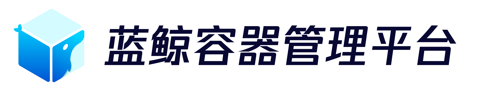

---
  

[EnglishDocs](./readme_en.md)

> **重要提示**: `master` 分支在开发过程中可能处于 *不稳定或者不可用状态* 。
> 请通过[releases](https://github.com/Tencent/bk-bcs/releases) 而非 `master` 去获取稳定的二进制文件。

蓝鲸容器管理平台（Blueking Container Service）定位于打造云原生技术和业务实际应用场景之间的桥梁；聚焦于复杂应用场景的容器化部署技术方案的研发、整合和产品化；致力于为游戏等复杂应用提供一站式、低门槛的容器编排和服务治理服务。

## Overview

使用BCS能做什么？

- [图形化、表单化](https://bk.tencent.com/docs/document/6.0/144/6521)编排和治理你的微服务应用
- 使用新的workload([GameStatefulSet](./docs/features/bcs-gamestatefulset-operator/README.md)，[GameDeployment](./docs/features/bcs-gamedeployment-operator/README.md))来部署和灰度更新你的复杂应用
- 无缝纳管已有的k8s集群及运行之上的应用
- 自动创建、销毁、更新、扩缩容你的k8s集群
- 跨云统一管理分布在不同IaaS上的k8s集群

了解BCS更详细功能，请参考蓝鲸容器管理平台[白皮书](https://docs.bk.tencent.com/bcs/)

## Features

- [Pod原地升级InplaceUpdate](./docs/features/bcs-gamestatefulset-operator/inPlaceUpdate.md)
- [容器镜像热更新HotPatchUpdate](./docs/features/bcs-gamestatefulset-operator/hotPatchUpdate.md)
- [基于Hook的应用交互式发布](./docs/features/bcs-hoo-operator/README.md)
- [自动化分步骤灰度发布](./docs/features/bcs-gamedeployment-operator/features/canary/auto-canary-update.md)
- [PreDeleteHook & PreInplaceHook优雅地删除和更新Pod](./docs/features/bcs-gamedeployment-operator/features/preDeleteHook/pre-delete-hook.md)
- [镜像预热]()
- [容器web-console](https://bk.tencent.com/docs/document/6.0/144/6541)
- [mesos-crd编排方案](https://github.com/Tencent/bk-bcs/blob/master/docs/features/mesos/%E5%9F%BA%E4%BA%8Emesos%E7%9A%84%E6%9C%8D%E5%8A%A1%E7%BC%96%E6%8E%92.md)

更多特性请参考[doc/features](https://github.com/Tencent/bk-bcs/blob/master/docs/features)

## Experience

* [使用BCS如何纳管已有k8s集群](https://bk.tencent.com/docs/document/6.0/144/8057#导入已有集群)
* [通过BCS模板集部署应用](https://bk.tencent.com/docs/document/6.0/144/8054)
* [通过BCS使用helm部署应用](https://bk.tencent.com/docs/document/6.0/144/6542)
* [通过GameStatefulset部署应用](./docs/features/bcs-gamestatefulset-operator/README.md)
* [通过BCS完成应用的交互式灰度更新](./docs/features/bcs-gamedeployment-operator/features/canary/auto-canary-update.md)
* [通过BCS完成业务的滚动升级](https://bk.tencent.com/docs/document/6.0/144/6517)
* [通过BCS完成业务的蓝绿发布](https://bk.tencent.com/docs/document/6.0/144/6518)
* [如何在BCS上插件容器监控信息](https://bk.tencent.com/docs/document/6.0/144/6515)

## Getting Started

* [下载与编译](docs/install/source_compile.md)
* [安装部署](docs/install/deploy-guide.md)
* [API使用说明](./docs/apidoc/api.md)

## Contributing

对于项目感兴趣，想一起贡献并完善项目请参阅[contributing](./CONTRIBUTING.md)。

[腾讯开源激励计划](https://opensource.tencent.com/contribution) 鼓励开发者的参与和贡献，期待你的加入。

## Support

* 参考bk-bcs [安装文档](docs/install/deploy-guide.md)
* 阅读 [源码](https://github.com/Tencent/bk-bcs)
* 参考 [bk-bcs产品文档](https://bk.tencent.com/docs/document/6.0/143/6474)
* 了解蓝鲸社区相关信息：蓝鲸社区版交流QQ群 495299374
* 直接反馈 [issue](https://github.com/Tencent/bk-bcs/issues)，我们会定期查看与答复
* 蓝鲸社区 [问答反馈](https://bk.tencent.com/s-mart/community)

## FAQ

* [蓝鲸容器FAQ](https://bk.tencent.com/docs/document/6.0/144/6522)
* [蓝鲸文档中心](https://bk.tencent.com/docs/)

## Blueking Community

* [BK-CI](https://github.com/Tencent/bk-ci)：蓝鲸持续集成平台是一个开源的持续集成和持续交付系统，可以轻松将你的研发流程呈现到你面前。
* [BK-CMDB](https://github.com/Tencent/bk-cmdb)：蓝鲸配置平台（蓝鲸CMDB）是一个面向资产及应用的企业级配置管理平台。
* [BK-PaaS](https://github.com/Tencent/bk-PaaS)：蓝鲸PaaS平台是一个开放式的开发平台，让开发者可以方便快捷地创建、开发、部署和管理SaaS应用。
* [BK-SOPS](https://github.com/Tencent/bk-sops)：标准运维（SOPS）是通过可视化的图形界面进行任务流程编排和执行的系统，是蓝鲸体系中一款轻量级的调度编排类SaaS产品

## 认证

**蓝鲸智云容器管理平台**通过中国**云计算开源产业联盟**组织的可信云容器解决方案评估认证——
[认证证书](./docs/overview/certificate.jpg)

## License

bk-bcs是基于MIT协议， 详细请参考[LICENSE](./LICENSE.txt)。
